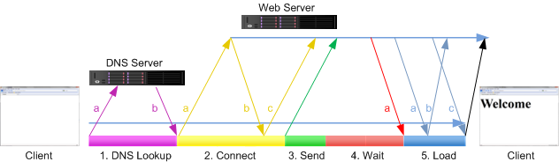
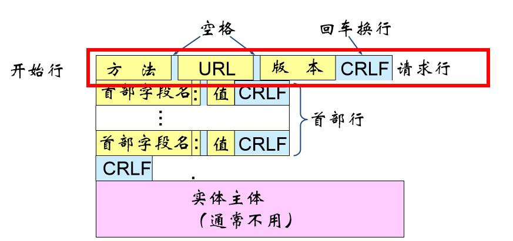
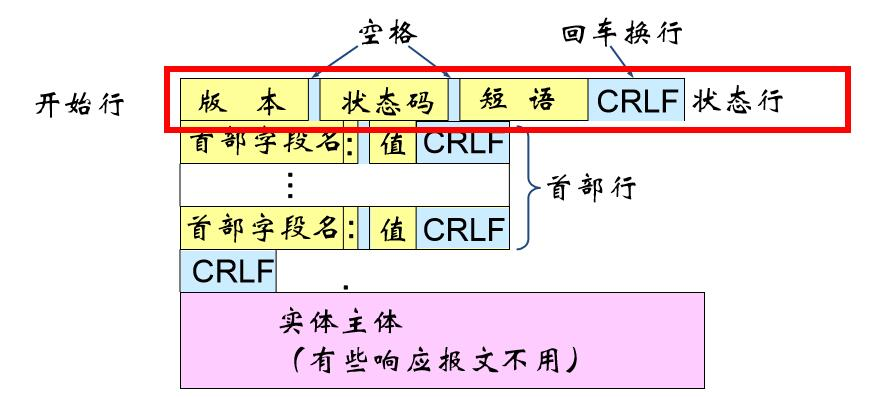

Web的基本架构
===
## Web的基本架构
- 开放式的客户/服务器结构（Client/Server），分成Web服务器（服务器端）、Web浏览器（客户端）以及传输协议（HTTP协议）三个部分。
- 用户通过Web客户端应用程序（即浏览器）向Web服务器发出请求，请求通过HTTP协议送到Web服务器；Web服务器根据客户端请求将保存在Web服务器中的某个页面通过HTTP协议返回给Web客户端；浏览器接收到页面后对其进行解释，最终将图文并茂的画面呈现给用户。
- URI解决资源定位问题，HTTP解决文档传输问题，HTML解决超文本文档的表示问题。

## Web浏览器
* 结构：用户界面、浏览器引擎、渲染引擎、网络、JS解释器、数据持久层
	- 渲染引擎：Gecko、KHTML(Webkit为其分支)、Presto和Trident等
* 是Web客户端的程序，用于浏览Web页面
* 利用HTTP协议将用户的请求传送给Web服务器，并接受服务器的Response
* 接收Web服务器送回的Web页面，并将其解释和显示


## Web服务器
* 结构：HTTP服务器、网络接口、Web页面
	- HTTP服务器提供与浏览器通信的网络接口
	- Web服务器应实现HTTP协议功能
* Hyperlink（超链接）：链接、关联各种多媒体信息
    - 超文本是万维网的基础，超媒体系统是超文本系统的扩充

### 域名系统（DNS）
* 用途：IP地址与域名之间的转换
	- IP地址（IPv4协议）
		* IP(v4) 地址是给全世界每一台连接在Internet上的设备分配的唯一的32bit的标识符，用点分十进制数表示
			* IP(v4) 地址的资源已经耗尽，目前IANA推荐使用IPv6地址，它的长度为128bit，可以使用冒分十六进制数表示。同时，相关的协议也进行了优化。
		* 每个IP 地址由两部分组成：网络号（Netid）和主机号（Hostid）。网络号用于标识一个网络；主机号用于标识在该网络中的一个主机
		* 私有IP 地址：不会被分配给Internet上的用户
			- A类：10.0.0.0~10.255.255.255 即10.0.0.0/8
			- B类：172.16.0.0~172.31.255.255 即172.16.0.0/12
			- C类：192.168.0.0~192.168.255.255 即192.168.0.0/16
	- 意义：使用有实际意义、易记忆的地址访问其他计算机
* 域名的树形结构：（从上至下）根域→顶级域→二级域→子域→主机
* 域名解析的过程
	- 递归查询：客户端只发一次请求，要求对方给出最终结果
	- 迭代查询：客户端发出一次请求，对方如果没有授权回答，它就会返回一个能解答这个查询的其它名称服务器列表，客户端会再向返回的列表中发出请求，直到找到最终负责所查域名的名称服务器，从它得到最终结果
* 安全问题：区域性停止解析服务

### 统一资源定位符URL
* 标准格式
	```协议类型:[//服务器地址[:端口号]][/资源层级UNIX文件路径]文件名[?查询][#片段ID]```
    - 查询：指请求的参数，一般是指URL中`?`后面的参数
	- 完整格式：`协议类型:[//[访问资源需要的凭证信息@]服务器地址[:端口号]][/ 资源层级UNIX文件路径]文件名[?查询][#片段ID]`
* 标准：RFC1738
* URL路径
	- 绝对路径
		* 由其在Web上的绝对位置定义的位置，包括协议和域名
		* 不管绝对URL在哪里使用，它总是指向确定的相同位置
	- 相对路径
		* 指向与链接的文件相关的位置
		* 与链接文件的位置关系
			- 处于同一目录，直接写文件名
			- 处于子目录，从目录名称往下写路径，直到指向所需文件
			- 需要返回上一级目录，使用符号`..`

## HTTP协议
* 面向事务的应用层协议
* HTTP 1.0协议是无状态的，本身无连接
* HTTP连接过程

    

    - 过程描述：DNS查询 → 建立连接 → 发送请求 → 等待响应 → 加载资源 → 关闭连接
	- Serial HTTP Connection vs Persistent HTTP Transactions：是否每次都需要三次握手连接

* HTTP报文

    === "请求报文"
    	

        报文由三个部分组成，即开始行、首部行和实体主体。在请求报文中，开始行就是请求行。

        * 方法：GET、POST、OPTION、HEAD、PUT、DELETE、TRACE、CONNECT
    	* URL：所请求的资源的URL
    	* 版本：HTTP的版本

    === "响应报文"
    	

        报文由三个部分组成，即开始行、首部行和实体主体。在响应报文中，开始行就是状态行。

        * 版本：HTTP的版本
    	* 状态码：1xx，2xx，3xx，4xx，5xx
    		- 1xx:表示通知信息，如请求收到了或正在进行处理
    		- 2xx:表示成功，如接受或知道了
    		- 3xx:表示重定向，表示要完成请求还必须采取进一步的行动
    		- 4xx:表示客户的差错，如请求中有错误的语法
    		- 5xx:表示服务器的差错，如服务器失效无法完成请求
        	- 常见的：200 OK 请求成功，403 Forbidden 禁止访问，404 Not Found 找不到服务器，500 Internal Server Error 内部错误，301 Moved permanently 永久重定向
    	* 短语：解释状态码

* HTTP包

    === "HTTP请求包拆解"

    	```
    	GET / HTTP/1.1  请求方法GET 请求URL：/（根目录） HTTP版本：1.1
    	Host: www.bilibili.com 被请求的Internet主机为www.bilibili.com，端口号为缺省的
    	Connection: keep-alive  持久连接
    	Upgrade-Insecure-Requests: 1  优先选择安全升级
    	User-Agent: Mozilla/5.0 (Windows NT 10.0; Win64; x64) AppleWebKit/537.36 (KHTML, like Gecko) Chrome/77.0.3865.90 Safari/537.36 浏览器标识，此处为chrome浏览器
    	Accept: text/html,application/xhtml+xml,application/xml;q=0.9,image/webp,image/apng,*/*;q=0.8,application/signed-exchange;v=b3 客户端接受xml/html、webp、apng等MIME格式资源
    	Sec-Fetch-Site: none
    	Accept-Encoding: gzip, deflate, br  客户端支持gzip、deflate、br三种压缩算法
    	Accept-Language: zh-CN,zh;q=0.9  客户端支持中文
    	Cookie: {涉及个人信息，省略}
    	```

        * 请求方式
        * URL路径
        * HTTP协议版本号 当前版本号：1.1（1997年发布）
    		* 2015年时，HTTP 2.0发布，多路复用机制
        * Host
    		* 发送请求时，该报头域是必需的
    		* 指定被请求的Internet主机和端口号
        * User-Agent可以进行伪装
        * Accept Accept-Charset Accept-Encoding Accept-Language用于双方内容协商
    		* MIME类型：text、image、audio、video、application五种，浏览器使用MIME类型而不是文件扩展名来决定如何处理文档。
        * Cookie
    		* 服务器发送到用户浏览器并保存在本地的一小块数据，它会在浏览器下次向同一服务器再发起请求时被携带并发送到服务器上。通常，它用于告知服务端两个请求是否来自同一浏览器，如保持用户的登录状态。Cookie使基于无状态的HTTP协议记录稳定的状态信息成为了可能。
        * DNT（Do Not Track）
    		* 用户对于网站追踪的偏好，0表示用户愿意目标站点追踪用户个人信息，1表示用户不愿意目标站点追踪用户个人信息。
        * Connection
    		* 决定当前的事务完成后，是否会关闭网络连接。
    		* HTTP 1.0默认值：close。
        * Upgrade-Insecure-Requests：优先选择安全性更高的版本
    		- 访问http网站会重定向至该网站的https版本

    === "HTTP响应包拆解"

    	```
    	HTTP/1.1 200 OK  HTTP版本：1.1 状态码：200 短语解释：OK
    	Date: Thu, 31 Oct 2019 13:27:25 GMT  消息生成于GMT时间2019-10-31 13：27：25
    	Content-Type: text/html; charset=utf-8  资源为html文本类型，字符集为utf-8
    	Transfer-Encoding: chunked
    	Connection: keep-alive
    	Cache-Control: max-age=30
    	gear: 1
    	vikingrCache: 60000
    	Vikingr-Cache-TTL: 14644
    	IDC: shjd
    	Vary: Origin,Accept-Encoding
    	Content-Encoding: gzip  请使用gzip解码以获得text/html类型的信息
    	Expires: Thu, 31 Oct 2019 13:27:55 GMT  响应于GMT时间2019-10-31 13：27：55过期
    	X-Cache-Webcdn: BYPASS from ks-bj-bgp-w-05
    	```

    	* Header
            * HTTP 版本，响应码在第一行
            * Server：Server首部包含了处理请求的服务器所用到的软件相关信息，比如nginx、apache等
            * Date：消息生成的日期和时间
    			- 此时间为GMT时间，非本地时间！
            * Content-Type：指示资源的MIME类型
            * Content-Length：实体正文的长度，以字节方式存储的十进制数字来表示
            * Connection：对于长连接的处理，保持(keep-alive)还是关闭(closed)
            * X-Frame-Options 网页嵌入选项
    			- `DENY`（不允许展示）/`SAMEORIGIN`（仅相同域名页面）/`ALLOW-FROM uri`（允许指定来源）
            * Last-modified：资源的最后修改日期和时间
    			- 此时间为GMT时间，非本地时间！
            * Accept-ranges：服务器是否支持指定范围请求及哪种类型的分段请求，bytes表明范围请求的单位是bytes（字节）
            * Cache-control 缓存机制，配合expires设置可以降低服务器负载
            * Vary：服务器遇到同一个URL对应着不同版本文档的情况时，如何缓存和筛选合适的版本
            * Content-Encoding：客户端应该怎样解码才能获取在Content-Type中标示的媒体类型内容
            * ETag 资源特定版本标识符
            * Content-Language：资源所用的自然语言
        * Message body
    		* 浏览器将要展示的HTML页面，以后讲述
