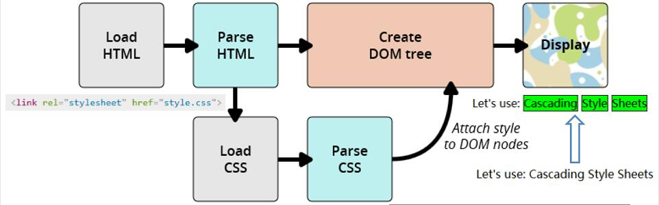
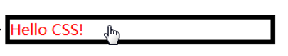
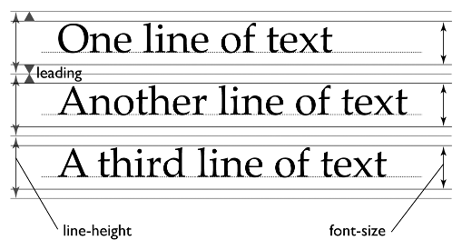
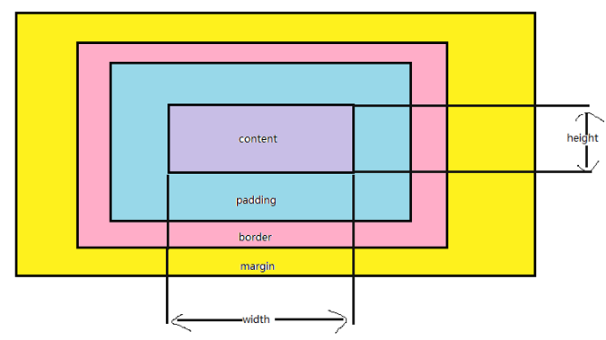

Web开发技术基础——CSS[^1]
===

## Cascading Style Sheet层叠样式表  
* 样式表语言，描述HTML语言的呈现  
	- 在没有CSS的时候，浏览器可以解析标签，使用内部的“默认样式”来渲染页面，来让页面具有基本的可读性，但是略显单薄
		* 这些默认样式包括：标题比正文字体要大，链接被高亮，段落分开，列表前有列表标识等
	- 作用：指定网页的样式和布局
* CSS的技术发展

    === "CSS1.0(1996.12)"
        * 结构：选择器+样式属性+伪类
	
    === "CSS2(1998)"
        
    
	=== "CSS2.1(2007)"
        * 作为推荐标准
        
	=== "CSS3(2001.5开始)"
		* 规范被分为若干个独立的模块
        
* CSS的工作过程
  
* 三种引用方式  
	
    === "外部样式表"
        - 在文件中定义，并在`head`元素中使用`<link>`元素引用  
		`<link rel = "stylesheet" href = "style.css">`  
		- 样式需要在多个页面中生效时，推荐此种方式
	
    === "内部样式表"
        - 将CSS放在HTML文件`head`元素的`<style>`标签中  
		`<style> /*your style*/ </style>`  
		- 某些内容管理系统不能直接编辑CSS文件，用此方法
	
    === "内联样式"
        - HTML元素中的`style`属性，如  
		`<h1 style="color:blue;border:...">Some contents...</h1>`  
		- 每个CSS仅影响一个元素
		- 难以维护，不建议使用
        
### CSS语法  
* 基本语法  
	* CSS文件构成：选择器+声明块  
		```css
		p{                             /* 选择p元素 */    
			color:red;                   /* inblock:p元素的颜色是红色的 */  
		}  
		```
	* 利用CSS控制样式  
		- 利用不可见的container  
		- 利用父子节点（<a href="#c_i">层叠和继承</a>）  
	* 规则：  
		* 规则在大括号中  
		* 冒号分隔属性与属性值  
		* 用分号分隔各个声明（最后一条规则可选）  
	* 注释：`/* comments here */`  
		- 以`/*`开头，以`*/`结尾
	* 简写属性（如`padding`）
		- 允许在一行设置多个属性
		- 顺时针顺序：上右下左  
	* 大小写不敏感（除`id`和`class`选择器名称）  
    
#### 语法详解：选择器  
* 简单选择器   
	* 元素选择器  
		选中所有元素名和选择器名匹配的元素（不区分大小写）  
		```css
		div {/* css样式 */}
		 ↑
		元素符号（即<div>标签本身名称） 
		```
	* 直接选择class或id  
	元素的class和id属性  
	> id/name属性：标识网页元素的唯一身份  
		```css
		<div id="first">aaa</div>  
		相应的id选择器：  
		#first{ /* css样式 */}
		↑ 井号 id选择器符号
		```
	> class属性：元素的分类（“标签”）  
		```css
		<div class="first">bbb</div>  
		相应的class选择器：  
		.first{ /* css样式 */}
		↑ 点号 class选择器符号
		```  
	> 可以为同一页面的不同元素设置相同的class，但是只能设置一个id  
* 属性选择器  
	属性选择器是一种特殊类型的选择器，它根据元素的属性和属性值来匹配元素。  
	```css
	p[class='new']{ /* css样式 */}
	↑    ↑     ↑
	元素 属性名 属性值  
	匹配方法：  
	[attr]（带有attr命名的属性的元素）  
	[attr=value]（以attr命名的，值为value的元素）  
	[attr~=value]（至少有一个attr命名的属性的元素）  
	[attr|=val]（属性attr的值是val，或以val-打头）  
	[attr^=val]（属性attr的值以val打头，包括val）  
	[attr$=val]（属性attr的值以val结尾，包括val）  
	[attr*=val]（属性attr的值中包含子字符串val）
	```
* 伪类（:）  
	匹配处于特定状态的一个或多个元素  
	- <a name="state">状态伪类（链接）</a>   
		`:link`  表示链接的正常状态，选择那些尚未被点过的链接  
		`:visited`  选择点过的链接  
		`:focus`  选择已经通过指针设备、触摸或键盘获得焦点的元素，在表单里使用得非常多  
		`:hover`  在用户指针悬停时生效，不只可用于链接  
		`:active`  选择被鼠标指针或触摸操作“激活的”元素，只发生在鼠标被按下到被释放的这段时间里    
		* 上述5个状态伪类（link、visited、focus、hover、active）需要按顺序书写 
			```css
			/* 一个伪类的例子 */
			p:hover{
				color:red;
				border: 5px solid #000000;
				cursor:pointer;
			}
			```  
		  
	- 结构伪类  
		`:first-child`  选择父元素的第一个子元素  
		`:first-of-type`  选择父元素容器内任意类型子元素的第一个元素  
		`:nth-child`  根据元素在标记中的次序选择相应的元素  
		`:only-child`  父元素中唯一的子元素  
		`:not`  选择与参数不匹配的元素  
		`:last-child、:last-of-type 、:nth-last-child、:nth-of-type、:nth-last-of-type、:only-of-type`  
	- 验证伪类（表单）  
		`:checked`伪类选择被勾选或选中的单选按钮、多选按钮及列表选项  
		`:default`伪类从表单中选择默认的元素，即“提交”按钮  
		`:disabled`伪类选择禁用状态的表单元素，`:enabled`启用状态  
		`:empty`伪类选择其中不包含任何内容的空元素  
		`:in-range`伪类选择有范围且值在指定范围内的元素，`:out-of-range`超出范围  
		`:indeterminate`伪类选择页面加载时没有勾选的单选按钮或复选框  
		`:valid`伪类选择输入格式符合要求的表单元素，`:invalid`不符合  
		`:optional`伪类选择表单中非必填的输入字段  
		`:read-only`伪类选择用户不能编辑的元素，`:read-write`元素可读可写，`:required`必填项（表单）  
	- 语言伪类  
		`:lang()` 基于元素语言来匹配页面元素
* 伪元素（::）  
	匹配元素的某个特定部分  
	“伪”：只能通过CSS创建，DOM树中不存在  
	1. `::before ::after`  为其他HTML元素添加内容（文本或图形），添加的内容不实际存在于DOM中，但可以像存在一样操作它们，需要在CSS中声明`content`属性   
	2. `::first-letter`  选择一行文本第一个字符，并且文字所处的行之前没有其他内容（如图片和内联的表格）  	
	3. `::first-line`  选择元素的第一行，只适用于块级元素，内联元素不适用  
	4. `::selection`  选择文档中被高亮选中的部分，基于Gecko的浏览器要使用`::-moz-selection`  
	
	!!! note
		1. `first-letter`只对块级元素生效，而`before`和`after`没有限制  
		2. 可以像操作正常html文档元素一样来操作它们。  
		
* 组合&多重选择器  
	以下，A和B是前述任意选择器  
    
	=== "群组选择器"  
        形如`A,B`，匹配满足A（和/或）B的任意元素。  
       
	=== "后代选择器"  
        形如`A B`，匹配任意元素，满足条件：B是A的在DOM树上的后代结点（B是A的子节点，或者A的子节点的子节点）。  
	
    === "子元素选择器"  
        形如`A>B`，匹配任意元素，满足条件：B是A的直接子节点。  
	
    === "相邻元素选择器"  
        形如`A+B`，匹配任意元素，满足条件：B是A的下一个兄弟节点（AB有相同的父结点，并且B紧跟在A的后面）。  
	
    === "后继元素选择器"  
        形如`A~B`，匹配任意元素，满足条件：B是A之后的兄弟节点中的任意一个（AB有相同的父节点，B在A之后，但不一定是紧挨着A）。  
    
* 通配选择器（*）  
	匹配任意类型的HTML元素。  
* 多重选择器：从右向左读，从上往下找（树）  
例子：
	```css
	#main li.important strong{color:red;}
	/* 含义：将id为main的li标签下所有important类的strong标签的内容设为红色。*/
	```
    
#### 语法详解：样式
* <a name="text-and-paragraph-style"></a>文本和段落    
	可以结合word文档的处理方法理解。  
	* <a name="text"></a>文本
		* font-family  
			- 语法：`font-family:字体1[,字体2，...];`  
			- 字体类型，可以指定多种，按优先顺序排列，逗号分隔  
			- 字体不可用：浏览器默认字体代替  
		* font-size  
			- 语法：`font-size:关键字/值;`
			- 值  
				* 单位：em、px、数字值、百分比  
					* px（像素）浏览器默认值是16px  
					* em继承字体大小，可伸缩性  
					* 百分比，相对于继承字体大小的百分比  
			- 关键字  
				* 绝对大小关键字：xx-small, x-small, small, medium, large, x-large, xx-large 
				* 相对大小关键字：larger, smaller，相对父元素 
		* text-transform  
			- 语法：`text-transform:属性值;`  
			- 值：none、uppercase（全部大写）、lowercase（全部小写）、captialize（首字母大写）  
		* font-weight  
			- 语法：`font-weight:粗细值;`  
			- 值
				* 关键字：normal、lighter、bold、bolder  
				* 数值：100~900的整百值，越大越粗
					* 一般使用normal(=400)、bold(=700)  
		* font-style
			- 语法：`font-style:属性值;`  
			- 值：normal、italic、oblique  
				* italic和oblique区别：有些字体有斜体属性，有些字体没有斜体属性。italic是使用文字的斜体，oblique是让没有斜体属性的文字倾斜
		* <a name="text-decoration"></a>text-decoration  
			- 语法：` text-decoration:属性值; `
			- 文本装饰：下划线(`underline`)、删除线(`line-through`)、顶划线(`overline`)、none（去掉a标签默认的下划线）  
			- 组合效果：`text-decoration-style + text-decoration-line + text-decoration-color = text-decoration`  
			也可一次指定多个值
		* <a name="text-shadow"></a>text-shadow  
			- 语法：`text-shadow:水平偏移 垂直偏移 模糊半径 颜色;`  
			- 值
				* 偏移值可为负值  
				* 可通过包含以逗号分隔的多个阴影值，将多个阴影应用于同一文本
		* <a name="color"></a>color  
			- 语法：`color:颜色值;`  
			- 用途：选中元素前景内容的颜色  
			- <a name="color-values"></a>值  
				* 十六进制颜色：＃RRGGBB，RR是红色，GG是绿色，BB是蓝色。所有值必须介于0和FF之间。  
					- 所有浏览器都支持  
				* RGB颜色：RGB（红，绿，蓝），每个参数（红色，绿色和蓝色）定义颜色的亮度，可在0和255之间，或一个百分比值（从0％到100％）之间的整数  
					- 255 = 100%  
					- 所有浏览器都支持  
				* RGBA颜色：rgb+alpha（透明度）  
					- alpha 0，完全透明；alpha 1，完全不透明。  
					- IE9, Firefox3+, Chrome, Safari, 和Opera10+支持  
				* HSL色彩  
					- HSL（色相，饱和度，明度）  
						* 色相是在色轮上的程度（从0到360），0（或360）是红色的，120是绿色的，240是蓝色的。饱和度是一个百分数，0%意味着灰色和100%的阴影，是全彩。明度也是一个百分数，0%是黑色的，100%是白色的。  
					- IE9, Firefox, Chrome, Safari，和Opera 10+支持  
				* HSLA色彩：hsl+alpha（透明度）  
					- HSLA颜色值被IE9, Firefox3+, Chrome, Safari, 和Opera10+支持  
	* <a name="text-layout"></a>布局
		* <a name="text-indent"></a>text-indent  
			- 语法：`text-indent:属性值;`
			- 定义段落的首行缩进  
				* 首行缩进两字符：`text-indent:2*font-size`  
			- 值：  
				* 接收像素、em值（可以为负值）、百分比  
		* <a name="text-align"></a>text-align  
			- 语法：`text-align:left|right|center|justify;`  
			- 控制文本水平方向的对齐方式  
				* justify：使文本对齐在两端，所有文本行宽度相同  
				* 只对文本文字和img标签有效  
		* <a name="line-height"></a>line-height
			- 语法：`line-height:属性值;`  
			- 值：数字、长度、百分比、关键字normal  
			- `line-height = font-size + leading`  
				* leading是填充在两行文字间的“铅条”  
				  
		* <a name="spacing"></a>letter-spacing & word-spacing  
			- 语法：`[letter-spacing|word-spacing]:属性值;`
			- 值：`normal|length|inherit`  
				* 前者控制字母间距，后者控制单词间距  
				
* <a name="list-style"></a>列表样式  
	* 以下三个样式，仅针对`<ol>` `<ul>`有效
	* list-style-type：符号类型  
		* 属性值：`disc（缺省值）|circle|square|...`  
		* 设置列表符号的类型  
	* list-style-position：符号位置  
		* 属性值：`outside（缺省值）|inside`  
		* 设置列表项符号位置  
	* list-style-image：符号图片  
		* 属性值：`url(指定图片地址)`  
		
		!!! info "探究"
			所指定的图片不存在，fallback如何？  
			> 相应位置显示为空白  
			
	* 缩写：`list-style：type image position`  
		* 例如`list-style:square url(example.png) inside;`  
		
* <a name="link-style"></a>链接样式（前述<a href="#state">状态伪类</a>）  
	* 默认样式：
		- 具有下划线  
		- 未访问过的链接是蓝色的，访问过的链接是紫色的  
		- 悬停在链接上时小鼠标变为小手图标  
		- 选中链接的时候，链接周围会有一个轮廓  
		- 激活链接的时候会变成红色(点击链接时按住鼠标按钮)  
	* 请按正确顺序设置链接样式！（LoVe Fear HAte）  
	* `:hover`伪类的高级用法  
		- 不仅可以用于链接，还可用于任意元素在鼠标经过的样式  
	* cursor  
		* 语法：`cursor:属性值;`  
		* 为链接设置鼠标样式  
			- 常用的：default、pointer（小手）、text（I字形，编辑文本常用）、crosshair（十字）等  
	* 去除默认的下划线 `text-decoration:none`  
	* 为链接添加图标：`background:[image] [color] [repeat] [size] [position]`  
	
* <a name="img-style"></a>图片样式  
	* width height：图片的宽度和高度  
	* border  
		- 语法：  
			```css
			border-width:属性值;   //图片边框宽度
			border-style:属性值;   //图片边框样式
			border-color:颜色值;   //图片边框颜色
			或 border:width style color; //简写
			```  
		- 具体见<a href="#border">边框高级用法</a>  
	* text-align：水平对齐  
		* 在图片的父元素上定义（详见上方<a href="#text-align">文本与段落样式</a>部分）  
	* vertical-align：垂直对齐  
		* 只对内联元素、表格单元格元素生效  
		* 属性值：`top|middle|baseline|bottom`
			
			!!! info "基线（Baseline）"  
				是英文字母x的下端线，而不是汉字的下端线  
				
	* float：文字环绕，图文混排
		- 属性值：`left（元素向左浮动）|right（元素向右浮动）|none（默认）|inherit（从父元素继承float属性的值）`  
		
* <a name="bg-style"></a>背景样式  
	* <a name="bg-color"></a>background-color
		- 语法：`background-color:颜色值;`  
		- 用途：设定元素的背景颜色  
		
		!!! attention "注意"
			1. 请使用合理的背景颜色和文本颜色搭配，这样可以提高文本的可读性。  
			2. 与<a href="#color">```color```</a>属性的区别：文本和背景  
			
	* <a name="bg-image">background-image</a>
		- 语法：`background-image:url("背景图像路径");`  
		- 用途：为元素设定背景图片  
			* 可以有多个图片，用英文逗号分隔
	* <a name="bg-repeat">background-repeat</a>
		- 语法：`background-repeat:属性值;`  
		- 用途：决定背景元素是否平铺，如何平铺  
		- 属性值：`no-repeat|repeat-x|repeat-y|repeat（默认，x、y轴均平铺）`  
	* <a name="bg-pos">background-position</a>  
		- 语法：`background-position:属性值;`  
		- 作用：设定背景图像的起始位置  
		- 属性值  
			* 关键字  
				```css
				param1 [param2]，其中param=top|left|center|right|bottom  
				若没有param2，则其值为center
				```  
			* 百分比  
				```css
				水平位置% 垂直位置%，左上角为0% 0%，右下角为100% 100%，若仅规定了一个值，则另一个值是50%
				```
			* position值  
				```css
				水平位置pos 垂直位置pos，左上角位置为（0，0），单位为任何CSS单位，若仅规定了一个值，则另一个值为50%
				```
				- position值可以与百分比值混用。
	* <a name="bg-size">background-size</a>
		- 语法：`background-size:属性值`
		- 作用：设置背景图像的大小
		- 属性值：
			* 长度
			* 百分比
			* 关键字
				- `cover`：浏览器将使图像足够大，使它完全覆盖了盒子区，同时仍然保持其高宽比。在这种情况下，有些图像可能会跳出盒子外
				- `contain`：浏览器将使图像的大小适合盒子内。在这种情况下，如果图像的长宽比与盒子的长宽比不同，则可能在图像的任何一边或顶部和底部出现间隙
	* <a name="bg-attachment">background-attachment</a>  
		- 语法：`background-attachment:属性值;`  
		- 用途：设定背景图像是随对象滚动还是固定不动  
		- 属性值
			* `scroll`（默认，元素的背景在页面滚动时滚动）
			* `fixed`（背景相对于视口固定）  
			* `local`（背景相对于元素的内容固定）
				- 只在IE9+中受支持
		
* <a name="table-style"></a>表格样式  
	* table-layout
		- 语法：`border-layout:[auto|fixed]`
			* 默认值为auto，浏览器将根据表格所含内容多少来计算表格和列的宽度
			* fixed：表格和列的宽度通过表格的宽度来设置，某一列的宽度仅由该列首行的单元格决定
				- 一定程度上可以加速渲染，但仍可能需要overflow属性来处理溢出的内容
	* border-collapse  
		- 语法：`border-collapse:属性值;`  
		- 决定表格边框是否合并  
		- 属性值：`separate（默认值，分开不合并）|collapse（边框合并）`
	* border-spacing  
		- 语法：`border-spacing:属性值;`  
		- 决定单元格边界的距离  
		- 属性值：  
			* 1个属性值时，该值作用在横向和纵向的间距上  
			* 2个属性值时，第一个值为横向间距，第二个值为纵向间距  
	* 标题样式
		- caption-side：决定标题在表格中的位置
			* 取值：`bottom|top`
			
	!!! tip "表格的斑马条纹效果"  
		思路：CSS结构伪类的应用。  
		对`tbody tr:nth-child(odd) tbody tr:nth-child(even)`分别指定不同的颜色  
		其中，`nth-child(odd)`也可以写成`nth-child(2n-1)`

#### 语法详解：层叠(cascade)与继承(inheritance) <a name = "c_i"></a> 

!!! question  
	多个选择器作用在同一个元素之上，附加了不同的样式规则，到底哪个规则最终会被作用到这个元素上？  

* <a name="cascade"></a>层叠  
	- 当同一个元素被两个选择器选中时，CSS会根据选择器的权重决定使用哪一个选择器。权重低的选择器效果会被权重高的选择器效果覆盖，这就是层叠。  
	- 决定选择器在层叠中胜出取决于三个因素，前面的因素会否决后面因素：  
		1. CSS规则的重要性和来源  		
		2. CSS规则的特殊性  
		3. CSS规则在文档中出现的顺序  
		
		!!! tip  
			如果在样式文档中通过`@import`引入新的样式文档，则引入样式文档中的规则出现顺序要先于原始样式文档以及头部中声明的规则。  
			
	- 层叠优先级算法  
		1. 针对某一元素的某一属性，列出所有给该属性定值的CSS规则  
		
			!!! info "CSS样式可能都来自哪里"  
				1. <a href="../2019.10.11#apply-css-and-js-in-webpage">作者样式表</a>（外部样式表、内部样式表、内联样式表）  
				2. 浏览器默认样式  
				3. 用户样式表  
				
		2. 根据声明的重要性和来源进行优先级排序  
		
			!!! info "重要性"  
				利用`!important`声明的CSS语句  
				
		3. 根据选择器的特殊性（Specificity）进行优先级排序  
		4. 根据CSS规则在样式文档中出现的位置（Source Order）进行优先级排序  
		
		!!! tip  
			声明重要性和来源优先级排序：用户代理样式表中的声明 < 用户样式表中的普通声明 < 作者样式表的普通声明 < 作者样式表的重要声明（`!important`） < 用户样式表的重要声明   
			<a name="specificity">选择器特殊性</a>：style标签（1000） > ID选择器（100） > 类、属性、伪类选择器（10） > 元素选择器、伪元素选择器（1）  
			* 优先级计算无进位，例如无论多少个元素选择器权重相加，也比不过一个类选择器  
			* 位置优先级：后来者居上  
			
	- 覆盖优先级计算：`!important`
		* 用于修改特定属性的值，能够覆盖普通规则的层叠
		* `!important`覆盖
			* 只能由另一个具有相同优先级，或者更高优先级的 `!important`规则改变，而且顺序靠后。
			
* <a name="inheritance"></a>继承  
	```html
		<p>aaa<em>bbb</em>ccc</p>
		<style>p{color:red;}</style>
	```  
	
	!!! info "上述例子的显示效果"  
		<p id="example1">aaa<em>bbb</em>ccc</p><style>p#example1{color:red;}</style>  
		
	- 继承性是指被包在内部的标签默认拥有外部标签的样式性，即子元素可以继承父元素的属性  
	- 继承可以避免同样的内容重复声明，减少CSS文件大小，提升网页加载速度  
	- 文本相关属性默认继承(`inherited:yes`)，布局相关属性默认不继承(`inherited:no`)  
		
		!!! info
			所有继承信息详见<https://www.w3.org/TR/CSS21/propidx.html>  

	- 默认继承最近祖先的属性值  
	- CSS控制继承：`inherit|initial|unset|revert|all:[inherit|initial|unset|revert]`  
		* `inherit`：从父类继承值  
		* `initial`：设定为初始值  
		* `unset`：如果从父类继承，则设定为继承值；否则，设定为初始值  
		* `revert`：表示样式表中定义的元素属性的默认值。若用户定义样式表中显式设置，则按此设置；否则，按照浏览器定义样式表中的样式设置；在用户默认样式表中使用时，等价于`unset`  
		* `all`：表示重设除`unicode-bidi`和`direction`之外的所有CSS属性的属性值，取值只能是initial、inherit、unset和revert  
	
* 样式覆盖冲突  
	1. 引用方式冲突  
		* 行内样式 >（内部样式 = 外部样式）  
		* 如果内部样式与外部样式相同，根据特殊性和源代码顺序进行比较  
	2. 继承方式冲突  
		* DOM树上最近的祖先获胜  
	3. 指定样式冲突  
		* 根据<a href="#specificity">特殊性</a>比较  
	4. 继承样式与指定样式冲突  
		* 指定样式获胜  
	5. `!important`  
		* 覆盖CSS中任何的其他样式声明  
		* 同一个样式多条`!important`，根据特殊性和源代码顺序进行比较  

#### 语法详解：盒模型  
* 页面中的每一个元素都可以看做一个“盒子”，占据一定的页面空间  overflow
* 盒模型四属性：border、margin、padding、content  
	  
	- <a name="content"></a>内容区content  
		* 属性：width、height、overflow  
		* 内联元素设定width、height无效  
		* 盒子模型的必备部分
		* `overflow`属性：内容过多超过`width`和`height`时，溢出处理的方法
	- <a name="padding"></a>内边距padding  
		* 用途：定义内容与边框间的距离  
		* 简写：top-right-bottom-left（顺时针方向）  
		* 也可以单独设置一边（如`padding-top`）  
	- <a name="border"></a>边框border  
		* 用途：元素边框  
		* 默认值：0
		* 属性：`width`、`style`、`color`，可简写，也可单独设置一边（如`border-top-style`）  
			- 先设置border-style，border-width才能生效  
			- border-style取值：`none|dotted|dashed|solid|double|groove|ridge|inset|outset`  
			- color：默认为元素本身的前景色  
			- 值设置顺序：上 右 下 左  
			
			!!! info "css值复制关系"  
				```text 
					 ________________
					 ↑      ↓       ↓
					top   right  bottom   left
					        ↓_______________↑
				```  
				top先复制到right和bottom，然后right复制到left。  
				当有两个值时，top → bottom，right → left，所以最终的属性为(上下，左右)  
				有三个值时，right → left，所以最终属性为(上，左右，下)
		
	- <a name="margin"></a>外边距margin  
		* 用途：定义页面中元素与元素之间的距离，“推开(`margin > 0`)”或“拉近(`margin < 0`)”其他盒子  
		* 默认值：0，透明   
		* 可简写，可分别设置（如`margin-bottom`）
		
* 块级元素、内联元素和盒模型  
	- <a name="block-element"></a>块级元素  
		* 有宽、高，可定义四个方向的`margin`  
		* 默认从上到下排列，占据整行  
	- <a name="inline-element"></a>内联元素  
		* 没有宽、高，可定义左右两个方向的`margin`  
		
		!!! info ""  
			但是内联块元素（inline-block）是有宽和高属性的  
			
		* 默认从左到右排列，占据需要的位置  
		* 指定位置需要通过包裹它的元素设置，或设定其`display`属性为`display:block;`  		
		* `overflow`：溢出元素内容区如何处理  
			- 属性值：`visible（默认值）|hidden|scroll|auto`  
				* `visible`：内容不会被修剪，呈现在元素框之外  
				* `hidden`：内容会被修剪，超出内容不可见  
				* `scroll`：浏览器显示滚动条以查看溢出内容
				* `auto`：如果内容被修剪，就显示滚动条（由浏览器决定）
			- 可以设定两个方向上的移动，如果指定了两个关键字，那么第一个参数是针对x方向，第二个参数是针对y方向的
				* 如果只想控制一个方向的滚动行为，用`overflow-x`或`overflow-y`
			
				
* 轮廓outline  
	- 是绘制于元素周围的一条线，位于边框边缘的外围，可起到突出元素的作用  
	- 也可通过`outline-color`、`outline-style`、`outline-width`设置样式  
* background-clip  
	- 背景色、背景图片默认应用于由内容和内边距、边框组成的区域，可以通过设置`background-clip`属性值来调整  
	- 属性值：`default（到边框）|padding-box（填充至内边距）|content-box（填充至内容区域）`  
	
!!! info "外边距重叠（margin collapsing）"  
	相邻块级元素的上外边距和下外边距有时会合并为一个外边距，其大小取其中的最大者  
	
!!! tip "`border-radius`属性"  
	`border-radius`可以为边框设置圆角(IE8-不支持)，四值顺序是左上、右上、右下、左下  
	
#### 语法详解：布局  

!!! info "CSS页面布局过程"  
	选择网页中的元素，并且控制它们相对正常文档流、周边元素、父容器或者主视口/窗口的位置  
	
* 正常文档流  
	- 元素盒子（任何一个HTML元素其实就是一个盒子）会基于文档的书写顺序一个接一个地排列，将窗体自上而下分成一行一行，块元素独占一行，相邻行内元素在每行中按从左到右地依次排列元素。
	- 脱离正常文档流  
		* 含义：用CSS控制元素的显示位置和文档代码顺序不一致  
		* float  
			- 属性值：`none（默认值）|left|right`  
			- 允许元素浮动到另外一个元素的左侧或右侧  
				* 两个元素同时为浮动元素，它们的外边距就会生效  
			- 清除浮动：`clear:left|right|both`  
				* 接下来的部分会以正常流形式绘制在其后  
* position
    - 固定定位：`position:fixed`  
        * 被固定的元素不会随滚动条拖动而改变位置  
            - 用于“回顶部”特效，固定栏目  
				
				!!! tip 
					可以配合`top` `left` `bottom` `right`属性定义元素相对浏览器四个边的位置  
					
    - 相对定位：`position:relative`  
        * 位置相对于原始位置计算而来  
				
            !!! warning ""
                所以该元素在原始文档流中还占有位置！
				
            !!! tip  
                可以配合`top` `left` `bottom` `right`属性设置元素相对原始位置的位移  
			
    - 绝对定位：`position:absolute`  
        * 绝对定位元素会脱离正常文档流  
				
            !!! warning ""
				所以该元素在原始文档流中占据的空间会被移除  
				
            !!! tip 
				可以配合`top` `left` `bottom` `right`属性定义元素相对浏览器四个边的位置  
					
    - 静态定位：`position:static`  
        * 默认状态下元素的定位值  
        * 含义：不会被特殊的定位  
				
* display
    - 隐藏元素：`display:none`  
			
        ??? faq "与`visibility:hidden`的区别"  
            * 被设置为`display:none`的元素不占空间，而`visibility:hidden`元素仍然占有空间  
			* `visibility`属性具有继承性，子元素会继承父元素的该属性  
				- 对子元素指定`visibility: visible`，则会重新显示出来  
			* `visibility`不影响计数器计数（对于`<li>`元素而言）  
				
    - 自动平均划分元素  
        父元素：`display:table`  
        子元素：`display:tabel-cell`  
			
        ??? tip "去除inline-block元素间距"  
            设置父元素`font-size`为0。

[^1]:本章节参考资料主要来源于MDN开发网：https://developer.mozilla.org/zh-CN/docs/Learn/CSS/ 由Mozilla贡献者基于[CC-BY-SA 2.5](https://creativecommons.org/licenses/by-sa/2.5/)及以上版本发布的“CSS——设计Web” 结合相关文字和课件共同整理