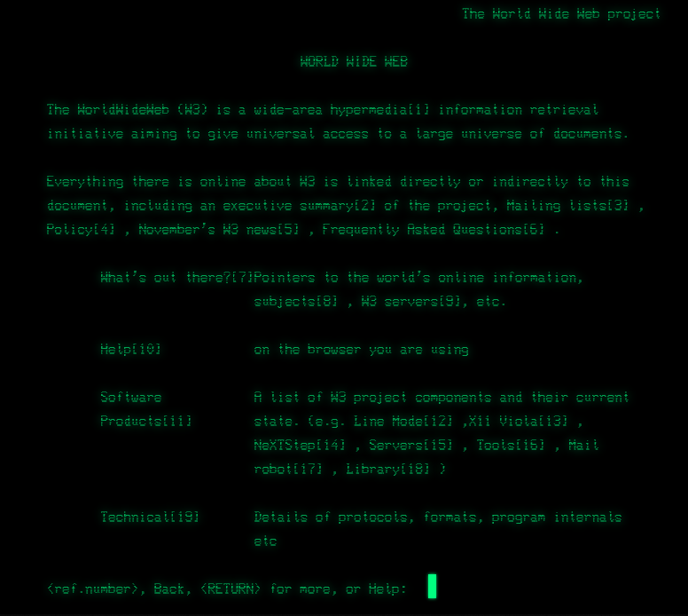

Web开发技术基础——引入
===
推荐网上资源：

1. [绿叶学习网](http://www.lvyestudy.com) ← 参考书配套学习网站
2. [mozilla开发网](https://developer.mozilla.org)
3. [在线工具](https://www.runoob.com)

## 万维网 互联网
- 万维网之父：Tim Berners-Lee
    - 知识互联
    - HTTP 0.9，HTML

    <figure markdown>
    { loading=lazy width=400 }
    <figcaption>最初的网页 http://line-mode.cern.ch/www/hypertext/WWW/TheProject.html</figcaption>
    </figure>

- W3C标准化
- 中国第一个www网站：中科院高能物理所
- web 1.0→2.0（社交网络）→3.0（语义网络）
- 改善隐私问题~去中心化：Solid(SOcial LInked Data)

三个核心协议：**URI**（资源定位），**HTTP**（传输），**HTML**（解析表示）
