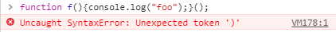
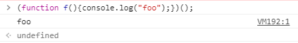
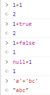
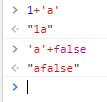
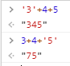
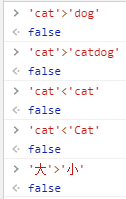
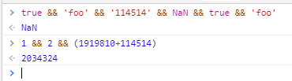

---
tags:
  - Web前端基础
comments: true
---
JavaScript
===
## JavaScript简介
* 定位：嵌入式（embedded）语言，通用的浏览器脚本语言
* 性能强大，简单易学
* 存在一些坑点（！），但不影响其火爆程度

	??? warning "JavaScript小坑集合"
	
		=== "变量提升"
			所有的声明语句都会被提升到代码的头部（这与JavaScript<a href="#how-javascript-compiles">解析代码的方式</a>有关）
	
			```javascript
			console.log(a); // (1)
			var a=1;// (2)
			```
	
			1. `a` 在这里还没有被赋值
			2. 输出 `undefined`
	
			一个很好的规避方法是使用<a href="#using-let">let</a>来声明代码！
	
		=== "这样注释也行？"
			由于历史原因，JavaScript也可以支持HTML代码的注释，但仅仅支持单行注释！
			```javascript
				var a = 1;<!--a = 4-->
				a // (1)
			```
	
			1. 输出 `1`
	
		=== "switch比较"
			`switch`语句后面的表达式，与`case`语句后面的表示式比较运行结果时，采用的是严格相等运算符（`===`），而不是相等运算符（`==`），这意味着比较时不会发生类型转换。
	
		=== "null也是一个对象？"
			怎么解释这个输出结果呢？
			```javascript
			typeof null // (1)
			```
	
			1. 输出 "object"
	
			这是JavaScript的历史原因造成的。JavaScript 语言第一版，只设计了五种数据类型（对象、整数、浮点数、字符串和布尔值），没考虑`null`，只把它当作`object`的一种特殊值。后来`null`独立出来，作为一种单独的数据类型，为了兼容以前的代码，`typeof null`返回`object`就没法改变了
	
		=== "有关`null`和`undefined`"
			1. 在`if`语句中，`null`和`undefined`都会自动转为`false`，相等运算符（`==`）会报告两者相等。
			2. `null`是一个表示为“空”的对象，转为数值是0；`undefined`是一个表示"此处无定义"的原始值，转为数值时为`NaN`。
			3. `null` ~ 此处不该有值 ； `undefined` ~ 缺少值
	
		=== "浮点数"
			浮点数不是精确的值，所以涉及小数的比较和运算要特别小心！
			```javascript
			0.1 + 0.2   // (1)
			0.3 / 0.2   // (2)
			```
	
			1. 输出 `0.3000000000000004`
			2. 输出 `1.499999999999998`
	
		=== "不完备的UTF-16支持"
			由于历史原因，JavaScript只支持两字节的字符，不支持四字节的字符，这导致码点在U+10000到U+10FFFF之间的字符，JavaScript总是认为它们是两个字符（`length` 属性为2），实际应该是1
	
		=== "with语句的坑"
			`with` 区块没有改变作用域，它的内部依然是当前作用域。这造成了`with`语句的一个很大的弊病，就是绑定对象不明确
			比如说，下方例子中，很难判断`x`到底是一个全局变量，还是obj的一个属性：
			```javascript
			with(obj){
				console.log(x);
			}
			```

* JavaScript标准：ECMA-262

??? faq "所以，Java和JavaScript有什么关系？"
	JavaScript的基本语法和对象体系是模仿Java而设计的（它俩是完全不一样的语言！），但JavaScript语言的函数是一种独立的数据类型，采用了基于原型（prototype）对象的继承链。
	Java需要编译，而JavaScript可以直接解释运行。

	??? info "什么叫基于原型？"
		具体请阅读 https://developer.mozilla.org/zh-CN/docs/Learn/JavaScript/Objects/Object_prototypes

## JavaScript的引用方式
* `<head></head>`标签内
* `<body></body>`标签内

!!! tip ""
	以上两种方法中，JavaScript代码均在`<script type="text/javascript"></script>`标签中

* 元素的事件属性（例如`onclick`、`onblur`）
* 外部引入
	```html
	<script src="path/to/script.js"></script>
	```

## <a name="how-javascript-compiles"></a>JavaScript基本语法

??? note "理解JavaScript的编译过程"
	JavaScript是一种解释型语言，通过词法分析和语法分析得到语法树后，就可以开始解释执行。JavaScript引擎解析脚本时，会预声明变量（var → `undefined`），预定义函数

    - 词法分析：字符流（char stream） → 记号流（token stream）
	- 语法分析：构造语法树

### 语句和表达式
- 以行为执行单位
- 语句以分号(`;`)结尾
- 变量
	* JavaScript变量名区分大小写
	* JavaScript是动态类型语言
    	```javascript
    	var a = 1;
    	a = 'hello'; // (1)
    	```

        1. 不会报错，即使改变成了字符串类型

	* 只声明变量而不赋值（此处针对`var`而言）
    	```javascript
    	var b;
    	b  // (1)
    	x  // (2)
    	```

        1. undefined
        2. ReferenceError:x is not defined

    * 变量的作用域

		!!! info "作用域"
			变量在程序中有效的范围，例如

			```javascript
			var a;          // (1)
			function foo(){
				a = "bar";
				var b = "c";   // (2)
				console.log(a + b);
			}
			```

            1. `a` 是全局变量，在整个脚本中都有效
            2. `b` 是局部变量，仅在当前函数体有效

		- JavaScript中，有全局变量和局部变量两种作用域大小。
			* ES6中，新增了块级作用域概念。由`{}`包括

	??? help "var,let和const"
		<a name="using-var">var</a>定义的变量，没有块的概念，可以跨块访问，不可以跨函数访问。

        <a name="using-let">let</a>定义的变量没有预解析过程（也就没有变量提升），不可以重复声明，有块级作用域。ES6标准新增

        <a name="using-const">const</a>用于声明常量，只可以被声明一次，且必须立即赋值，不能修改。ES6标准新增

		!!! warning "const不可修改？"
			```javascript
			const person = {
				name : 'jiuke',
				sex : '男'
			}
			person.name = 'test'
			console.log(person.name)  // (1)
			```

            1. 为什么这里会输出"test"？

			对象是引用类型的，person中保存的仅是对象的指针，这就意味着，`const`仅保证指针不发生改变，修改对象的属性不会改变对象的指针，所以是被允许的。也就是说`const`定义的引用类型只要指针不发生改变，其他的不论如何改变都是允许的。


- 标识符（identifier）
	* 第一个字符可以为任意Unicode字母、美元符号（`$`）和下划线（`_`）
		- 中文也可以做标识符
	* 第二个字符往后，也可以用数字
	* 保留字不可以做标识符

		??? info "JavaScript保留字"
			break、delete、function、return、typeof、case、do、if、switch、var、catch、else、in、this、void、continue、false、instanceof、throw、while、debugger、finally、new、true、const、with、default、for、null、try、class、enum、export、extends、import和super等

- 注释

	=== "单行注释"
        ```javascript
        //this is a single line comment
        ```

	=== "多行注释"
        ```javascript
        /*
            this is a multi line comment
        */
        ```

### 区块
- 使用大括号`{}`将多个相关语句组合在一起，用于构成其他更复杂的语法结构
- 条件语句

    === "if语句"
		```javascript
		if(condition){
			//condition meets
		}
		```

		- if-else结构
			```javascript
			if(condition){
				//condition meets
			}[else if(condition2){
			  	//...
			  }...]else{
				//all conditions do not meet
			}
			```
		- `else`总是与离自己最近的那个`if`语句配对

	=== "switch语句"
		```javascript
		switch(var){
			case expr1:
			//...
			break;
			case expr2:
			//...
			break;
			...
			default:
			//...
		}
		```

	=== "三元运算符 `?:`"
		- `(condition)?expr1:expr2`等价于
		```javascript
		if(condition){
			expr1;
		}else{
			expr2;
		}
		```

	=== "循环语句"
		- `while`循环：`while(condition){expr;}`
		- `for`循环：`for(init;test;increment){expr;}`
		- `do-while`循环：`do{expr;}while(condition);`
		- `break`和`continue`
			* `break`用于跳出循环
			* `continue`用于终止本轮循环，返回头部，开始下一轮循环
		- 标签（label）
			```javascript
			label:
				expr;
			```
			* 作为定位符，不可以是保留字
			* 通常与`break`和`continue`配合使用
			* 代码块相关：`[break|continue] 代码块名`

### 数据类型

!!! info ""
    数值、字符串、布尔值称为<a name="basic-type"></a>统称为原子类型，不可再分

!!! info
	可以使用`typeof`运算符获得某一值的数据类型

=== "数值(Number)"
    包括整数和小数

=== "字符串(string)"
    文本

=== "布尔值(boolean)"
    - 只有`true`和`false`两种值
    - 返回布尔值
        * 前置逻辑运算符：`!`
        * 相等比较符：`!==`,`===`,`!=`,`==`
        * 比较运算符：`>=`,`>`,`<=`,`<`

=== "undefined"
    * 变量定义了，但是没有赋值
	* 定义了函数，应该提供的参数没有传值进去，或者没有返回值
	* 对象的某属性没有赋值

=== "null"
    * 作为函数的参数，表示该函数的参数为空
	* 作为对象原型链的终点

=== "object"
    * 各种值组成的集合
	* 又可分为object（狭义）、array、function

#### 数值
- 基于IEEE754标准的双精度64位浮点数
- 最大值和最小值

	```javascript
	Number.MAX_VALUE
	Number.MIN_VALUE
	/* ECMAScript 6 Standard */
	Number.isSafeInteger()   // (1)
	Number.MAX_SAFE_INTEGER
	Number.MIN_SAFE_INTEGER
	```

    1. 目前，绝对值小于2的53次方的整数都可以精确表示

- 表示法
	* 十进制（没有前导0）、十六进制（前缀0x或0X）、八进制（前缀0o或0O或有前导0，且只用到0~7的数值）、二进制（前缀0b或0B）

- 特殊的值
	* 正零和负零
		- 唯一的区别是64位浮点数表示法的符号位不同
		- 做分母时，一个返回`-Infinity`，一个返回`Infinity`
	* NaN：非数字
		- 字符串转换为数值失败时，结果为NaN
		- 数学运算发生错误时，结果为NaN
		- 它仍然属于`Number`类（`typeof NaN`输出“number”）
		- NaN不等于任何值，包括它本身
			* 任何值（包括`NaN`本身）与`NaN`比较，返回的都是`false`
	* Infinity：无穷值
		- `Infinity`大于一切数值，`-Infinity`小于一切数据，除了`NaN`以外
		- `Infinity`与`NaN`之间比较总会返回`false`

- <a name="global-number-funcs"></a>与数值有关的全局方法
	* `parseInt(string[,radix=10])`方法
		- 用途：字符串 → 整数
		- 从左向右，直到遇到不能转换为数字的字符，返回转好的部分，否则返回`NaN`
		- 参数非字符串，先转为字符串再转换
		- 类似的方法：`parseFloat(string)`
			* 将它的字符串参数解析成为浮点数并返回。如果在解析过程中遇到了正负号(+或-)，数字(0-9)，小数点，或者科学记数法中的指数(e或E)以外的字符，则它会忽略该字符以及之后的所有字符，返回当前已经解析到的浮点数。同时参数字符串首位的空白符会被忽略
	* `isNaN(value)`方法
		- 用途：判断一个值是否为`NaN`
		- 先将`value`转换为Number，然后比较

		!!! tip "更加可靠的方法"
			```javascript
			function myIsNaN(value){
				return value!=value;
			}
			```

	* `isFinite(value)`方法
		- 用途：判断某个值是否为正常的数值，除了`Infinity`、`-Infinity`、`NaN`和`undefined`四个值以外，都会返回`true`

#### 字符串
- 零个或多个排在一起的字符，放在单引号或双引号中
	* 默认只能写成一行，必须分多行的话，用反斜杠（`\`）续行。
	* 可以用`+`号连接多个单行字符串。

	!!! info "转义符：`\`"
		表示一些特殊字符，如`\0`、`\n`、`\r`等

- 字符串也可视为字符数组
	* 下标访问法：`[]`运算符返回某一位置的字符
		- 编号从0开始
		- 下标不是数字，或超出字符串长度，则返回`undefined`

	!!! warning "`string`不可改变"
		1. 字符串内部的单个字符无法增删，作修改不生效，也不会报错（！）
		2. 字符串的长度（`length`）属性不会被改变

- Unicode
	* 每个字符在JavaScript内部都是以16位（即2个字节）的UTF-16格式储存。
	* 可以在JavaScript程序中直接用来表示字符

		```javascript
		var f\u006f\u006f = "a";
		foo  // (1)
		```

        1. 也会输出字符"a"

- Base64相关方法
	* `btoa()`：任意值转换为Base64编码
	* `atob()`：Base64编码转换为原来的值

	!!! tip "非ASCII字符（如中文）怎么base64？"
		请在中间插入一个转码环节（如`encodeURIComponent()`），再使用这两个方法

#### 对象
- 是一组“键值对”（key-value）的集合，是一种无序的复合数据集合
	* 键名和键值之间用冒号分隔
	* 两个键值对之间用逗号分隔
		- 最后一个属性后面可以不加逗号
	* 一个例子：
		```javascript
		var obj = {
			foo:"hello",
			bar:"world"
		};
		```
- 对象的键名是字符串
	* 在ES6标准下，Symbol值也可以用作键名（“加不加引号都可以”）
	* 键名是数值，会被自动转为字符串
	* 键名不符合标识名的要求，则必须加上引号
- 属性（Property）：对象的键名
	* 对象的键值可以为任何数据类型
	* 若键值为函数，通常把它称为“方法”，它可以像函数那样调用
		```javascript
		var obj = {
			p:function (x){
				return 2 * x;
			}
		};
		var val = obj.p(1)  //now val = 2
		```
		* 如果属性的值还是对象，就可以形成链式引用
	* 属性可以动态创建
	* 读写属性：点运算符（`.`）或方括号（`[]`）运算符
	* 属性查看：`Object.keys()` `Object.values()`
	* 属性删除：`delete`
		- 若删除成功，则返回`true`
		- 删除一个不存在的属性，`delete`不会报错，而且也会返回`true`！
		- 无法删除继承属性

		??? info "`delete`什么时候返回`false`？"
			属性存在，且不可被删除

			!!! info "不可被删除？"
				`Object.defineProperty(obj,prop,descriptor)`会直接在一个对象上定义一个新属性，或者修改一个对象的现有属性，并返回这个对象。
				在属性中设置`configurable`为`false`。

	* 属性是否存在：`in` 运算符
		- 检查对象是否包含某个属性（检查的是键名，不是键值），如果包含就返回`true` ，否则返回`false`。它的左边是一个字符串，表示属性名，右边是一个对象

			!!! info "是否为对象自身属性？"
				`in`无法判断对象的属性是本身的，还是继承而来的，请使用对象的`hasOwnProperty()`方法来判断

	* <a name = "enuming-an-object"></a>属性的遍历：`for..in`循环
		- 遍历的是对象所有可遍历（enumerable）的属性，会跳过不可遍历的属性
		- 它不仅遍历对象自身的属性，还遍历继承的属性

- 对象的引用
	* 不同的变量名指向同一个对象，那么它们都是这个对象的引用，也就是说，它们指向同一个内存地址
	* 修改其中一个变量，会影响到其他所有变量
	* 取消某一个变量对于原对象的引用，不会影响到另一个变量对原对象的引用
	* 引用只局限于对象，如果两个变量指向同一个原始类型的值，变量这时都是值的拷贝

??? faq "表达式还是语句？"
	经过前面的学习后，现在可以发现`{foo:123}`可能具有两种含义：

	1. 表达式：一个包含foo属性的对象
	2. 语句：一个代码区块，里面有一个标签foo，指向表达式123

    到底是哪种呢？V8 引擎规定，如果行首是大括号，一律解释为对象。为了避免歧义，最好在大括号前加上圆括号，明确其为对象。

- `with`语句：绑定对象

	```javascript
	with(object){
		// (1)
	}
	```

    1. `foo="bar"` 等价于 `object.foo="bar"`

	* 如果`with`区块内部有变量的赋值操作，必须是当前对象已经存在的属性，否则会创造一个当前作用域的全局变量
		- 所以，应该先定义对象的属性，然后在`with`区块内操作它

#### 函数
* 声明函数：`function`命令
	- `function` 命令后面是函数名，函数名后面是一对圆括号，里面是传入函数的参数，函数体放在大括号里面
	```javascript
	function fun_name(arguments){
		//function body
	}
	```
* 函数表达式：`var var_name = function [fun_name](arguments){};`
	- 不加`fun_name`，函数为匿名函数
	- 加上`fun_name`，函数名仅在函数体内部有效
	- 末尾要加上分号
* `Function`构造函数
	- 可以传递任意数量的参数给`Function`构造函数，只有最后一个参数会被当做函数体。
	- 如果只有一个参数，该参数就是函数体。
	- 可以不使用`new`命令，返回结果完全相同。
* 函数名提升
	- 采用`function`命令声明函数时，整个函数会像变量声明一样，被提升到代码头部
	- 重复声明函数，前一次的声明会无效。
	- 如果同时采用 `function` 命令和赋值语句声明同一个函数，最后总是采用赋值语句的定义
* 调用函数：圆括号运算符`()`
	- 圆括号之间是函数参数
	- 内部的`return`语句表示函数返回，非必需
	- 可以调用自身，这就是递归（recursion）
* 属性
	- `name`：函数的名字
		* 通过变量复制定义的函数，如果：
			* 变量的值是一个匿名函数，那么`name`属性返回变量名
			* 变量的值是一个具名函数，那么`name`属性返回函数表达式的名字
	- `length`：参数个数的多少
	- `toString()`方法：函数的源码，包含注释
	- 作用域
		* 函数外部声明的变量就是全局变量（global variable），它可以在函数内部读取
		* 在函数内部定义的变量，外部无法读取，称为“局部变量”（local variable）
		* 函数内部定义的变量，会在该作用域内覆盖同名全局变量
		* 变量提升：在函数内，`var` 命令声明的变量，不管在什么位置，变量声明都会被提升到函数体的头部
* 参数
	- 如果有同名的参数，则取最后出现的那个值，即使后面的没有值或被省略，也是以其为准
	- 省略参数值：`undefined`
	- 传递方式
		* 参数为原始类型：按值传递
			- 在函数体内修改参数值，不会影响到原始值
		* 参数为复合类型：按址传递
			- 在函数体内修改参数值，会影响到原始值
	- `arguments`对象
		* 只能在函数体内使用，包含了函数运行时的所有参数
		* `arguments.length`：函数调用时传入了多少个参数
		* 正常模式下可修改，严格模式 下修改无效，但不报错

* 闭包（Closures）[^1]
	- 嵌套的内部函数引用了嵌套的外部函数的数据（变量或函数），就产生了闭包
		* 闭包存在于嵌套的内部函数中
		* 在嵌套函数定义执行结束后产生，嵌套函数成为垃圾对象时死亡
	- 共享相同的函数定义，但保存了不同的词法环境
		* 这个环境包含了这个闭包创建时所能访问的所有局部变量
		* 每当 JavaScript 执行一个函数时，都会创建一个作用域对象（scope object），用来保存在这个函数中创建的局部变量 ，它和被传入函数的变量一起被初始化
	- 闭包 = 函数 + 被创建函数的作用域对象
		* 原理
			1. 外部函数的局部变量若会被闭包函数调用，就不会在外部函数执行完毕之后立即被回收，如下述例子的变量`i`。

                ```javascript hl_lines="2" linenums="1"
				function A() {
				  var i = 2;
				  return function() {
					console.log('i = '+i);
				  }
				}

				var a = A();
				a(); // (1)
				```

                1. 输出`i = 2`

				!!! info "解释"
					调用`A`的时候就创建了一个作用域对象，我们姑且称之为`Aa`，那么这个`Aa`应该是这样的： `Aa = { i: 2 };`  在`A`函数返回一个函数之后，`A`执行完毕。`Aa`对象本应该被回收，但是由于返回的函数使用了`Aa`的属性`i`，所以返回的函数保存了一个指向`Aa`的引用，所以`Aa`不会被回收。

			2. 每调用一次外部函数就产生一个新的闭包，以前的闭包依旧存在且互不影响。
			3. 同一个闭包会保留上一次的状态，当它被再次调用时会在上一次的基础上进行。

                ```javascript hl_lines="2" linenums="1"
				function A() {
				  var num = 42;
				  return function() { console.log(num++); }
				}
				var a = A();
				a(); // (1)
				a(); // (2)

				var b = A();  // (3)
				b(); // (4)
				```

                1. 42
                2. 43
                3. 重新调用`A()`，形成新闭包
                4. 42

				!!! info "解释"
					1. 当我们连续调用两次`a();`，`num`会在原基础上自加。说明同一个闭包会保留上一次的状态，当它被再次调用时会在上一次的基础上进行。
					2. 我们的`b();`的结果为42，说明它是一个新的闭包，并且不受其他闭包的影响。

			4. 在外部函数中存在的多个函数“同生共死”
				- `fun1` `fun2` `fun3`被同时声明并且都可以对作用域对象的属性（局部变量）进行访问与操作。

                    ```javascript hl_lines="3" linenums="1"
					var fun1, fun2, fun3;
					function A() {
					  var num = 42;
					  fun1 = function() { console.log(num); }
					  fun2 = function() { num++; }
					  fun3 = function() { num--; }
					}

					A();
					fun1();   // (1)
					fun2();
					fun2();
					fun1();    // (2)
					fun3();
					fun1();   // (3)

					var old = fun1;

					A();
					fun1();   // (4)
					old();   // (5)
					```

                    1. 42
                    2. 44
                    3. 43
                    4. 42
                    5. 43，上一个闭包的`fun1()`

			!!! warning "当闭包遇见循环变量"
				看这个例子：
				```javascript
				function buildArr(arr) {
					var result = [];
					for (var i = 0; i < arr.length; i++) {
						var item = 'item' + i;
						result.push( function() {console.log(item + ' ' + arr[i])} );
					}
					return result;
				}
				var fnlist = buildArr([1,2,3]);
				fnlist[0]();  //  item2 undefined
				fnlist[1]();  //  item2 undefined
				fnlist[2]();  //  item2 undefined
				```
				这个例子中的作用域对象为
				```javascript
				var bArr = {
				   item: 'item2',
				   i: 3,
				   arr: [1,2,3]
				}
				```
				当循环全部结束的时候作用域对象中的属性`i`正好是`i++`之后的3，而`arr[3]`是没有值的，所以为`undefined`。但是在最后一次循环，也就是`i = 2`的时候，`item`的值为`item2`，当 i++，i = 3循环条件不满足循环结束，此时的`item`的值已经被保存下来了，所以此时的`arr[i]`为`arr[3]`，而`item`为`item2`。
				怎么输出`item0 1  item1 2  item2 3`呢？要点是存储`i`的每一个状态！
				```javascript hl_lines="4-9"
				function buildArr(arr) {
					var result = [];
					for (var i = 0; i < arr.length; i++) {
						result.push( (function(n) {
						   return function() {
							  var item = 'item' + n;
							  console.log(item + ' ' + arr[n]);
						   }
						})(i));
					}
					return result;
				}
				var fnlist = buildArr([1,2,3]);
				fnlist[0]();  //  item0 1
				fnlist[1]();  //  item1 2
				fnlist[2]();  //  item2 3
				```
				或者使用`let`关键字声明循环变量
				```javascript hl_lines="3"
				function buildArr(arr) {
					var result = [];
					for (let i = 0; i < arr.length; i++) {
						let item = 'item' + i;
						result.push( function() {console.log(item + ' ' + arr[i])} );
					}
					return result;
				}
				var fnlist = buildArr([1,2,3]);
				fnlist[0](); // item0 1
                fnlist[1]();  //  item1 2
                fnlist[2]();  //  item2 3
				```

		* 典型应用场景
			1. 循环遍历添加监听函数
				```javascript
				for(var i = 0,length = btns.length; i < length; i++){
					(function(i){
						var btn = btns[i];
						btn.onclick = function(){
							alert('第'+(i+1)+'个')
						}
					})(i);
				}
				```
			2. 自定义JS模块
				- 所有数据和功能封装在函数内部
				- 向外暴露一个包含若干方法的对象或函数
				```JavaScript
				function myModule(){
					var d = /* some private data */
					function A(){}
					function B(){}
					// other function
					return {
						A : A,
						B : B,
						// other function
					}
				}
				// 或
				(function (){
					var d = /* some private data */
					function A(){}
					function B(){}
					// other function
					window.myModule = {
						A : A,
						B : B,
						// other function
					}
				})()
				```


* 立即调用的函数表达式（IIFE）
	- 不可以直接在定义末尾加入圆括号`()`来调用，会报错。
        <figure>
		
        <figcaption>报错如图所示</figcaption>
        </figure>

        * 产生报错，与 JavaScript 的解析方式相关。JavaScript 引擎规定，如果`function`关键字出现在行首，一律解释成语句，此时这一段都是函数的定义，不应该以圆括号结尾，于是报错
		* 不要让`function`出现在行首，让引擎将其理解成一个表达式
            <figure>
            
            </figure>

    - 综上：让解释器以表达式来处理函数定义

	!!! summary "IIFE表达式"
		* 只要行首不为`function`关键字，令引擎理解为一个表达式，就可以正常使用`()`来立即调用
            1. `(function(){/*code*/}());`
		    2. `(function(){/*code*/})();`
		* 推而广之，任何让解释器以表达式来处理函数定义的方法，都能产生立即调用的效果
		    1. `var i = function(){return 114514;}();`
		    2. `true && function(){/*code*/}();`
            3. `0, function(){/*code*/}();`
            4. `!function(){/*code*/}();`  此处可以将`!`换为`~` `-` `+`

#### 数组
数组（array）是按次序排列的一组值。每个值的位置都有编号（从0开始），整个数组用方括号(`[]`)表示。

!!! tip "array相关的小说明"
	1. 任何类型的数据，都可以放入数组（数值、对象、数组、函数）
	2. 如果数组的元素还是数组，就形成了多维数组
	3. 数组支持定义时和定义后赋值

!!! tip "array：特殊的object"
	```javascript
	var arr = ['a',{b:4},[1,2,3]];
	typeof arr;   //object
	```
	数组的特殊性体现在它的键名是按次序排列的一组整数，本质还是字符串，但是在读取时非字符串键名会被转换为字符串

* 数组的属性
	- `length`：数组长度（数组成员数量）
		* 数组的数字键不需要连续
		* 可以通过修改`length`属性值随时增减数组的成员
			- 可以通过修改`length`属性值为0来删除所有的数组成员
			- 当`length`属性设为大于当前数组长度时，读取新增的位置都会返回`undefined`
			- JavaScript 使用32位整数来保存数组元素个数，`length`的最大值也就是4294967295（=2<sup>32</sup> - 1）
			- 只要不为空数组添加整数键，数组的`length`值保持为零

* `in` 运算符：检查某个键名是否存在
	- 如果数组的某个位置是空位，`in` 运算符返回`false`

* 数组遍历<!--（`for key in collaboration`）-->

	=== "for...in循环"
		- 不仅会遍历数组所有数字键，还会遍历非数字键，<b>不推荐使用它遍历数组</b>
		- 也可<a href="#enuming-an-object">遍历对象</a>

	=== "for循环或while循环"
		```javascript
		//for loop
		var arr=[2,4,6,10];
    	for(var i=0;i<arr.length;i++){
        	console.log(arr[i]);
    	}
		//while loop
		var l = arr.length;
		while(l--){
			console.log(arr[l]);
		}
		```

	=== "forEach方法"
		- 为数组中的每一个有效元素执行一次`callback`函数。遍历数组让数组中的每一个元素做一件事情。那些已经被删除（使用`delete`方法等情况）或者未初始化的项将被跳过（但不包含那些值为`undefined`的项目）。
			```javascript
			var arr = [];
			arr[0] = "a";
			arr[3] = "b";
			arr[10] = "c";
			arr["name"] = "Hello world";
			arr.forEach((data, index, array) => {
				console.log(data, index, array);
			});
			/* output:
			a 0 ["a", 3: "b", 10: "c", name: "Hello world"]
			b 3 ["a", 3: "b", 10: "c", name: "Hello world"]
			c 10 ["a", 3: "b", 10: "c", name: "Hello world"]
			*/
			```

* 数组的空位
	- 当数组的某个位置是空元素，即两个逗号之间没有任何值，我们称该数组存在空位（hole）
		* 数组的空位不影响`length`属性
		* 如果最后一个元素后面有逗号 ，不会产生空位
	- 删除（`delete`）某个数组元素，会留下一个空位，且不影响`length`属性
	- 读取空位的值会返回`undefined`
		* 但是某个位置有无元素与该位置是不是`undefined`无关！

### 运算符
* 算术运算符

	!!! summary ""
		JavaScript提供了10个运算符，用来完成各种运算：加（`+`）、减（`-`）、乘（`*`）、除（`/`）、指数（`**`）、余数（`%`）、自增（`++`）、自减（`--`）、数值（`+`）、负数值（`-`）

	- 加法运算符
		* 基本规则：操作数没有字符串，则非数值类型转为数值计算。操作数有字符串，则加法运算符变为连接运算符，任何非字符串操作数转为字符串类型

		

		

		* 加法运算符存在重载现象，在运行时决定，到底是执行相加还是执行连接

   		

		!!! note ""
            这种机制仅加法具有

		* `object`相加：转为<a href="#basic-type">原子类型</a>的值(`.valueOf().toString()`)，然后再相加

	- 余数运算符
		* 余数运算符（`%`）返回前一个运算子被后一个运算子除所得的余数
		* 运算结果的正负由第一个运算子的正负号决定

	- 自增和自减运算符
		* 将运算子首先转为数值，然后加上1或者减去1，它们会修改原始变量

	- 数值和负数值运算符
		* 将任何值转为数值（与<a href="#use-number-converting">`Number`</a>函数的作用相同），会返回一个新的值，而不会改变原始变量的值

	- 指数运算符
		* 前一个运算子是底数，后一个运算子是指数
		* 此运算是右结合的

* 赋值运算符：算术运算符 + ‘=’
	- 将右侧运算结果赋值给左侧变量

* 比较运算符
	- 比较两个值的大小，然后返回一个布尔值，表示是否满足指定的条件

		!!! summary ""
			JavaScript提供了8个比较运算符，分为相等比较和非相等比较：大于（`>`）、小于（`<`）、小于或等于（`<=`）、大于或等于（`>=`）、相等（`==`）、严格相等（`===`）、不相等（`!=`）、严格不相等（`!==`）

    === "相等比较"
        涉及到四种运算符：`==` `===` `!==` `!=`

        === "=="

            - 比较相同类型的数据时，与严格相等运算符完全一样

            - 比较不同类型的数据时，先将数据进行类型转换，然后再用严格相等运算符比较
                * 原始类型的值会转换成数值再进行比较
                * 对象与原始类型的值比较时，对象转换成原始类型的值，再进行比较
                * `undefined` 和`null` 与其他类型的值比较时，结果都为`false`，它们互相比较时结果为`true`

        === "==="

            * 原始类型比较：值相等返回`true`，否则返回`false`

            * 复合类型比较（`array`、`function`、`object`）：不是比较它们的值是否相等，而是比较它们是否指向同一个地址
    		    - `{}==={}` `[]===[]` `(function(){}===function(){})`的结果均为`false`，因为它们存放在不同的内存地址上
			    - 两个变量引用一个对象，则它们相等

        === "!="

            先求相等运算符的结果，然后返回相反值

        === "!=="

            先求严格相等运算符的结果，然后返回相反值

		* 相等运算符（`==`）比较两个值是否相等，严格相等运算符（`===`）比较它们是否为“同一个值”
		* 如果两个值不是同一类型，严格相等运算符（`===`）直接返回`false`，而相等运算符（`==`）会将它们转换成同一个类型，再用严格相等运算符进行比较

        !!! summary "记住以下几个特殊比较结果"
            ```javascript
            undefined === undefined  //true
            null === null   //true
            NaN === NaN    //false
            +0 === -0     //true
            ```

	=== "非相等比较"
		* 都是字符串，字典序比较
			- 实际上比较的是Unicode码点大小
                <figure>
				{ loading=lazy }
                <figcaption>一些比较结果，其中“大”的 Unicode 码点是22823，“小”是23567</figcaption>
                </figure>
		* 否则，均转换为数值，比较数值大小
			- 对象转为原始类型的值，再比较：先调用`valueOf`方法；如果返回的还是对象，再接着调用`toString`方法

* 布尔运算符
	- 用于将表达式转为布尔值
	- 包含四个运算符：取反（`!`）、且（`&&`）、或（`||`）、三元（`?:`）

    === "取反"
    	用于将布尔值变为相反值，对于非布尔值，取反会将其转为布尔值

    === "且"
    	- 如果第一个运算子的布尔值为`true`，则返回第二个运算子的值（注意是值，不是布尔值）
		- 如果第一个运算子的布尔值为`false`，则直接返回第一个运算子的值，且不再对第二个运算子求值（“短路”）
		- 多个连用的且运算符，返回第一个布尔值为`false` 的表达式的值。如果所有表达式的布尔值都为`true`，返回最后一个表达式的值

        

    === "或"
		- 如果第一个运算子的布尔值为`true`，则返回第一个运算子的值，且不再对第二个运算子求值（“短路”）
		- 如果第一个运算子的布尔值为`false`，则返回第二个运算子的值

    === "三元"
		三元条件运算符由问号（?）和冒号（:）组成，分隔三个表达式，如果第一个表达式的布尔值为`true` ，则返回第二个表达式的值，否则返回第三个表达式的值

* 二进制位运算符
	- 用于直接对二进制位进行计算，只对整数起作用，其他类型会被转为整数后再执行位运算
	- 一共7个运算符：或（`|`）、与（`&`）、否（`~`）、异或（`^`）、左移（`<<`）、右移（`>>`）、带符号位的右移（`>>>`）

### 类型转换

=== "强制类型转换"

    === "转化为数字"
        - 使用<a name="use-number-converting">`Number()`</a>
        - 参数为原始类型
            * 数值：不变
            * 字符串：逐位解析，只要不能解析为数值，就返回`NaN`
                - 空字符串被转为0
            * 布尔值：`true` → 1 `false` → 0
            * `undefined` → `NaN`
            * `null` → 0
        - 参数是对象
            * 除非为只有一个数值的数组，否则返回`NaN`

    === "转化为字符串"
        - 使用<a name="use-string-converting">`String()`</a>
        - 参数为原始类型
            * 数值：转为相应的字符串
            * 字符串：不变
            * 布尔值：`true`转为字符串"true"，`false`转为字符串"false"
            * `undefined`：转为字符串"undefined"
            * `null`：转为字符串"null"
        - 参数是对象
            * 狭义对象：返回一个类型字符串
            * 函数：返回函数的`toString`值
            * 数组：返回该数组的字符串形式

    === "转化为布尔值"
        - 使用<a name="use-boolean-converting">`Boolean()`</a>
        - 除了`undefined` `null` `NaN` `-0` `+0` `''`的转换结果为`false`，其他的值全部为`true`

=== "自动类型转换"

    === "转换为布尔值"
        - JavaScript预期某位置应该是布尔值时，该位置的值会被类型转换（自动调用`Boolean()`函数）
            * 除了以下几个值被转换为`false`，其他值都是`true`
                - `undefined`
                - `null`
                - `false`
                - 0（包括+0和-0）
                - `NaN`
                - 空字符串
            * 空数组（`[]`）和空对象（`{}`）对应的布尔值都是`true`

    === "转换为字符串"
        - JavaScript 遇到预期为字符串的地方，就会将非字符串的值自动转为字符串，主要发生在字符串的加法运算时
        - 先将复合类型的值转为原始类型的值，再将原始类型的值转为字符串

    === "转换为数值"
        - JavaScript 遇到预期为数值的地方，会将参数值自动转换为数值，系统内部会自动调用`Number()`函数

### 错误处理机制
* JavaScript 解析或运行时，一旦发生错误，引擎就会抛出一个错误对象
	- JavaScript 原生提供`Error`构造函数，所有抛出的错误都是这个构造函数的实例
		* `new Error([message[, fileName[,lineNumber]]])`
* `try-throw-catch-finally`

    === "基本结构"

        ```javascript
        try{
            tryCode // (1)
        }
        catch(err){
            catchCode // (2)
        }
        finally{
            finallyCode // (3)
        }
        ```

        1. 尝试执行的代码块
        2. 捕获错误的代码块
        3. 无论`try`/`catch`结果如何都会执行的代码块

    === "运行示例"

        ```javascript
        function f(){
            try{
                console.log(0);
                throw('bug');
            }catch(e){
                console.log(1);
                return true;    // (1)
                console.log(2); // (2)
            }finally{
                console.log(3);
                return false;   // (3)
                console.log(4); // (4)
            }
            console.log(5);     // (5)
        }

        var result = f(); // (6)
        result  // (7)
        ```

        1. 原本会延迟到`finally`代码块结束再执行
        2. 不会执行
        3. 覆盖了上面的`return`
        4. 不会执行
        5. 不会执行
        6. 输出`0 1 3`
        7. 输出`false`

## JavaScript标准库
### 标准内置对象
- 值属性：`Infinity`、`NaN`、`undefined`、`null`
- 函数属性
	* 全局函数可以直接调用，不需要在调用时指定所属对象，执行结束后会将结果直接返回给调用

        === "`eval()`"
			- 在当前作用域中，注入代码
			- 参数为字符串
				* 非字符串则原样返回
			- 对参数尝试调用JS解释器进行求值
			- 参数会作为语句执行，小心使用！

		=== "`isFinite()`"
            - 判断被传入的参数值是否为一个有限数值
            - 在必要情况下，参数会首先转为一个数值

            !!! info ""
                在`Number`对象上的`Number.isFinite()`方法，不会转换参数为数值

        === "`isNaN()`"
            - 判断一个值是否为`NaN`
            - 在必要情况下，参数会首先转为一个数值
            - 因为`NaN` 不能通过相等操作符来判断，所以这个函数是有必要的
            - 算术运算返回一个未定义或无法表示的值，或不能强制转化为数值的非数值转化为数值时，会得到`NaN`

            !!! info ""
                在`Number`对象上的`Number.isNaN()`方法，不会转换参数为数值

		=== "`parseInt(string,radix)`"
            - 解析一个字符串`string`并返回指定基数的十进制整数，`radix` 是2-36之间的整数，表示被解析字符串的基数。
            - 当 `radix` 不符合范围要求，或第一个非空格字符不能转换为数字时，返回`NaN`
            - `radix` 的默认值不一定是10，需要看字符串结构而定

        === "`parseFloat(string)`"
            - 解析一个字符串参数并返回一个浮点数

		=== "URI编解码函数"

			!!! notice "使用URI编解码函数的必要性"
				 URI 由组件分隔符分割的组件序列组成，一般形式如

                 ```html
                 <scheme> <!-- (1) -->
                   ://<authority> <!-- (2) -->
                      <path>?<query> <!-- (3) -->
                 ```

                 1. scheme 表示协议，比如http，ftp
                 2. authority 用`:// `来和scheme 分割，常见的authority格式如下：`<userinfo>@<host>:<port>`
                 3. path在 scheme 和 authority 确定下来的情况下标识资源，path由几个段组成，每个段用 `/` 来分隔；query 查询串，用 `?` 和 `path` 分隔

                 如果这些分隔符出现在某个组件内，就会破坏组件原本的含义，所以要转义。

                 RFC2396规定，path的保留字符集为"/" | "?" | ";" | "="，query的保留字符集为";" | "/" | "?" | ":" | "@" | "&" | "=" | "+" | "," | "$“

			- ASCII码0-31，127-255会被转义；有一部分不安全的符号也会被转义
			- `encodeURI()` `decodeURI()`
				* `;/?:@&=+$,#- _ . ! ~ * ' ( )` 不会被转义
				* 操作的是完整的 URI，这两个函数假定 URI 中的任何保留字符都有特殊意义，所以不会编码它们
			- `encodeURIComponent()` `decodeURIComponent()`
				* 转义除了字母、数字、`- _ . ! ~ * ' ( )` 外的所有所有字符
				* 操作的是组成 URI 的组件，这两个函数假定任何保留字符都代表普通文本，所以必须编码它们

		=== "`escape()`"
			* 对字符串进行编码，这样就可以在所有的计算机上读取该字符串
			* 除了 `*` `@` `-` `_` `+` `.` `/` ASCII字母和数字外均进行编码

- 基本对象：定义或使用其他对象的基础。基本对象包括一般对象、函数对象和错误对象
	* `Object`、`Function`、`Boolean`、`Symbol`、`Error`、`EvalError`、`InternalError`、`RangeError`、`ReferenceError`、`SyntaxError`、`TypeError`、`URIError`

- 数字和日期对象：用来表示数字、日期和执行数学计算的对象

    === "Number"
        - 经过封装，可以处理数字值的对象
        - JavaScript 的 `Number` 类型为双精度IEEE754 64位浮点类型，能够准确表示的整数范围在`-2^53~2^53`之间。

        !!! info ""
            `BigInt` 任意精度数字类型已进入 `stage3` 规范中

        - 静态属性：`Number.MAX_VALUE` `Number.MIN_VALUE` `Number.NaN`等
        - 静态方法

            1. 是否为`NaN`：`Number.isNaN()`
            2. 是否为有限数：`Number.isFinite()`
            3. 是否类型为`Number`且为整数：`Number.isInteger()`
            4. 是否为安全表示的整数：`Number.isSafeInteger()`
            5. 数字转换：`Number.parse[Float|Int]()`

    === "Math"
        - 提供各种数学功能
		- 不可被实例化，所有的属性和方法都必须在`Math`对象上调用
		- 静态属性：`Math.E` `Math.PI` `Math.SQRT2`等
		- 静态方法

            1. `Math.random()`：返回`[0,1)`之间的伪随机数

                !!! tip "任意范围的随机数生成"
    				```javascript
    					function getRandom(min,max){
    						return Math.random()*(max-min)+min;
    					}
    					function getRandomInt(min,max){
    						return Math.floor(Math.random()*(max-min+1))+min;
    					}
    				```

            2. 三角函数
            3. 最大值、最小值
            4. 取整
				- 向下取整：`Math.floor()`
				- 向上取整：`Math.ceil()`
            5. 指对运算：`Math.pow()` `Math.log()`
            6. 绝对值：`Math.abs()`
            7. 四舍五入：`Math.round()`
            8. 平方根：`Math.sqrt()`

    === "Date"
        - 它以1970 年1 月1 日00:00:00 作为时间的零点，可以表示的时间范围是前后各1亿天，单位为毫秒
        - 直接调用`Date()`：返回代表当前时间的字符串
        - `new Date()`：也是当前时间
            * 可以传参数（毫秒数、字符串、多个整数……），返回对应的时间实例
        - 运算
            * 类型自动转换时，`Date`实例如果转为数值，则等于对应的毫秒数；如果转为字符串，则等于对应的日期字符串
                - 日期相加（+）相当于字符串连接，相减（-）相当于数值运算
        - 静态方法
            1. `Date.now()`：返回当前时间距离时间零点（1970 年1 月1 日00:00:00 UTC ）的毫秒数
            2. `Date.parse()`：解析日期字符串，返回该时间距离时间零点（1970 年1 月1 日 00:00:00 ）的毫秒数
				* parse失败会返回`NaN`
            3. `Date.UTC()`：接受年（必需）、月（必需）、日等变量作为参数，返回该时间距离时间零点（1970 年1 月1 日 00:00:00 UTC ）的毫秒数
        - 类方法
            1. 转字符串类：`toString()`、`toUTCString()`、`toLocaleString()`、`toDateString()`方法
            2. getter方法：`getFullYear()`、`getMonth()`、`getDate()`、`getHours()`、`getMinutes()`、`getSeconds()`等
				* getDay返回0代表星期日，1代表星期一
				* 注意getMonth，返回0代表1月，11代表12月
            3. setter方法：`setFullYear(year[,month,date])`、`setMonth()`、`setDate(date)`、`setHours(hour[,min,sec,ms])`、`setMinutes(min[,sec,ms])`、`setSeconds(sec[,ms])`等

- 字符串对象：用来表示和操作字符串的对象
    * `String`的实例方法

        === "`match`"
            * 使用：`str.match(dest)`
            * 确定原字符串是否匹配某个子字符串，返回一个数组，成员为匹配的第一个字符串。如果没有找到匹配，则返回`null`
				- 返回的数组有`index`和`input`属性，分别表示匹配字符串开始的位置和原始字符串
            * 可以使用正则表达式作为参数

        === "`search`"
            * 使用：`str.search(dest)`
            * 返回值为匹配的第一个位置，如果没有找到匹配，则返回`-1`

        === "`replace`"
            * 使用：`str.replace(src,dest)`
            * 用于替换匹配的子字符串，一般情况下只替换第一个匹配（除非使用带有`g`修饰符的正则表达式）

        === "`charAt`"
            * 使用：`str.charAt(index)`
            * 返回指定位置的字符，参数是从0开始编号的位置
            * 如果参数为负数，或大于等于字符串的长度，返回空字符串

        === "`concat`"
            * 使用：`str.concat(str1[,str2,...])`
            * 用于连接两个字符串，返回一个新字符串，不改变原字符串
            * 如果参数不是字符串，`concat` 方法会将其先转为字符串，然后再连接

        === "`slice`"
            * 使用：`str.slice(start[,stop])`
            * 从原字符串取出子字符串并返回，不改变原字符串
                - 如果省略第二个参数，表示子字符串一直到字符串结束
                - 如果参数是负值，表示从结尾开始倒数计算的位置，即该负值加上字符串长度
                - 如果第一个参数大于第二个参数，返回一个空字符串

        === "`indexOf`"
            * 使用：`str.indexOf(Charsequnce)`
            * 从头部开始确定一个字符串在另一个字符串中第一次出现的位置，返回结果是匹配开始的位置。如果返回-1，就表示不匹配
            * `lastIndexOf()`：从尾部开始匹配

        === "`trim`"
            * 使用：`str.trim()`
            * 去除字符串两端的空字符（空格+制表符、换行符、回车符），返回一个新字符串，不改变原字符串

        === "大小写转换"
            * 转换为小写`toLowerCase()`
            * 转换为大写`toUpperCase()`

        === "`split`"
            * 使用：`str.split(delimiter[,maxMemberCount])`
            * 按照给定规则分割字符串，返回一个由分割出来的子字符串组成的数组
				- 如果分割规则为空字符串，则返回数组的成员是原字符串的每一个字符
				- 如果省略参数，则返回数组的唯一成员就是原字符串
				- 如果满足分割规则的两个部分紧邻着或位于开头结尾，则返回数组之中会有一个空字符串
				- 可以接受第二个参数，限定返回数组的最大成员数

        === "`localCompare`"
            * 使用：`str1.localCompare(str2)`
            * 在考虑自然语言顺序的情况下，用于比较两个字符串，返回一个整数，如果小于0，表示第一个字符串小于第二个字符串；如果等于0，表示两者相等；如果大于0，表示第一个字符串大于第二个字符串

    * `RegExp`：将文本与一个模式匹配，正则表达式

- 可索引的集合对象：这些对象表示按照索引值来排序的数据集合，包括数组和类型数组，以及类数组结构的对象
    * Array、Int8Array、Uint8Array、UintClampedArray、Int16Array、Uint16Array、Int32Array、Uint32Array、Float32Array、Float64Array
    * Array类介绍
        - Array 构造函数输入不同的参数 ，行为不一致
            * 无参数返回空数组
            * 单个正整数参数作为数组长度
            * 单个非数值，此参数将作为数组的成员
            * 多参数，所有参数都将作为数组的成员
        - 判断数组：`Array.isArray()`
        - 实例方法
            1. `push()`和`pop()`
				* `push`方法用于在数组的末端添加一个或多个元素，并返回添加新元素后的数组长度
				* `pop`方法用于删除数组的最后一个元素，并返回该元素。对空数组使用`pop`方法，不会报错，而是返回`undefined`
				* 这两种方法均改变原数组

            2. `shift()`和`unshift()`
				* `shift()` 方法用于删除数组的第一个元素，并返回该元素
				* `unshift()` 方法用于在数组的第一个位置添加元素，并返回添加新元素后的数组长度

            3. `join(delimiter=",")`
				* 以指定参数作为分隔符（默认为逗号），将所有数组成员连接为一个字符串返回
				* 如果数组成员是`undefined` 或`null` 或空位，会被转成空字符串

            4. `concat()`
				* 用于合并数组
				* 接收数组或非数组作为参数，新成员添加到原数组成员的后部，原数组不变

            5. `reverse()`
				* 颠倒排列数组元素，返回改变后的数组
                * 原数组被改变

            6. `slice([start[,end]])`
				* 提取目标数组的一部分，返回一个新数组（包含start，不包含end），原数组不变
				    - 如果省略所有参数，返回原数组的拷贝
					- 如果省略第二个参数，则一直返回到原数组的最后一个成员
					- 如果slice 方法的参数是负数，则表示倒数的位置
					- 如果第一个参数大于等于数组长度，或者第二个参数小于第一个参数，则返回空数组

            7. `splice(start, count, addElement1, addElement2, ...)`
				* 删除原数组的一部分成员，并可以在删除的位置添加新的数组成员，返回值是被删除的元素
				    - 会改变原数组！
					- 第一个参数是删除的起始位置（从0 开始），第二个参数是被删除的元素个数。如果后面还有更多的参数，则表示这些就是要被插入数组的新元素
					- 起始位置是负数表示从倒数位置开始删除
					- 第二个参数设为0表示单纯地插入元素
					- 只提供第一个参数表示删除到结尾

            8. 排序：`sort([function_sortby])`
				* 对数组成员进行排序，默认是按照字典顺序排序。
					- 自定义排序：传入一个函数作为参数
						* `sort` 的参数函数本身接受两个参数，表示进行比较的两个数组成员
						* 如果返回值大于0，表示第一个成员排在第二个成员后面，否则第一个成员排在第二个成员前面
				* 排序后，原数组改变
				* 数值会被先转成字符串，再按照字典顺序进行比较

            9. `map(function(currentValue[,index,arr])[, thisValue])`
				* 将数组的所有成员依次传入参数函数，然后把每一次的执行结果组成一个新数组返回，原数组没有变化
				    - 函数调用时，`map`方法向它传入三个参数：当前成员、当前位置和数组本身
					- 可选的thisValue参数用于绑定回调函数内部的this变量，指向外部的某一数组
					- 如果数组有空位，`map` 方法的回调函数在这个位置不会执行，会跳过数组的空位，但不会跳过`undefined` 和`null`

            10. `forEach(function(currentValue,index,arr))`
				* 也是对数组的所有成员依次执行参数，只不过不返回值
				* `forEach` 方法也会跳过数组的空位，但不会跳过`undefined` 和`null`

            11. 过滤：`filter(function(currentValue,index,arr))`
				* 用于过滤数组成员，满足条件的成员组成一个新数组返回，原数组没有变化
				    - 所有数组成员依次执行参数所指向的函数，返回结果为true 的成员组成一个新数组返回

            12. 断言：`some()`和`every()`
				* 接受一个函数作为参数，所有数组成员依次执行该函数，该函数有三个参数：当前成员、当前位置和整个数组，然后返回一个布尔值
					- 所有成员都符合function条件，则`every()`返回`true`
					- 任意成员符合function条件，则`some()`返回`true`

            13. `reduce()`和`reduceRight()`
				* 参数：`function(total, currentValue[, currentIndex, arr])[, initialValue]`
					- 第一个参数都是一个函数。该函数接受以下四个参数：
						* 累积变量，默认为数组的第一个成员
                        * 当前变量，默认为数组的第二个成员
                        * 当前位置（从0开始）
                        * 原数组
				* 依次处理数组中的每一个成员，最终累计为一个值

            14. `indexOf()`和`lastIndexOf()`
				- `indexOf` 方法返回给定元素在数组中第一次出现的位置，如果没有出现则返回-1
                - `lastIndexOf` 方法返回给定元素在数组中最后一次出现的位置，如果没有出现则返回-1
				- 这两个方法都可以接受第二个参数，表示搜索的开始位置
				- 这两个方法内部，使用严格相等运算符（`===`）进行

- 使用键的集合对象：这些集合对象在存储数据时会使用到键，支持按照插入顺序来迭代元素
    * Map、Set、WeakMap、WeakSet

- 结构化数据：这些对象用来表示和操作结构化的缓冲区数据，或使用 JSON（JavaScript Object Notation）编码的数据
    * ArrayBuffer、SharedArrayBuffer、Atomics、DataView、JSON

[^1]: 本部分参考https://www.cnblogs.com/wind-lanyan/p/6080160.html 和课件pdf共同整理
*[严格模式]: ECMAScript 5中采用限制性Javascript变体的模式，在脚本所有语句之前需要放置特定语句'use strict'
